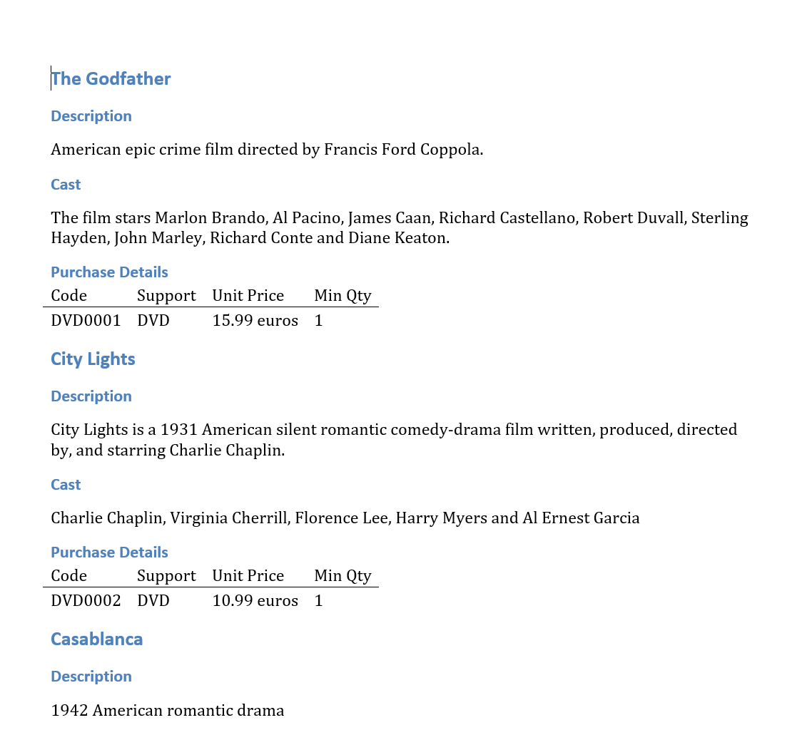

# Introduction
The *examples* subdirectory contains several sample files. They are explained in details below.

In the following we assume that *csv2mdText* has been compiled and installed according to instructions in [README](../README.md) and that the current directory is *csv2mdText/examples*.

# Examples Description
## (1) *sample_1.csv*
This file contains a list of DVDs with related information organized into a csv file. The first row in the file contains the name of the corresponding columns, which can be printed by issuing the following command:

> $ csv2mdText -d sample_1.csv
> 
> Field 1:        Movie Id
>
> Field 2:        Movie Name
>
> Field 3:        Support
>
> Field 4:        Unit Price
>
> Field 5:        Minimum Qty
>
> Field 6:        Movie Short Description
>
> Field 7:        Cast

The template file is *sample_1_template.md*, which is structured as follows:

> $ cat sample_1_template.md
> 
> \## $2
> 
> \### Description
> $6
> 
> \### Cast
> $7
> 
> \### Purchase Details
> 
> | Code | Support | Unit Price | Min Qty |
> 
> |:----|:----|:----|:----|
>
> | $1 | $3 | $4 | $5 |

The correspondence among placeholders in the markdown template (i.e. *$n* strings) and actual values extracted from rows of the input csv files is as follows:

> $1 is substituted by:        Movie Id
>
> $2 is substituted by:        Movie Name
>
> $3 is substituted by:        Support
>
> $4 is substituted by:        Unit Price
>
> $5 is substituted by:        Minimum Qty
>
> $6 is substituted by:        Movie Short Description
>
> $7 is substituted by:        Cast
> 

The markdown output (sample_1.md) is obtained by issuing the following command:

> csv2mdText -i sample_1.csv -o sample_1.md -t sample_1_template.md

The output appears as follows:

By using [pandoc](https://pandoc.org/) or some online converters the output can be converted into other formats (e.g. *.docx*):

## (2) *sample_2.csv*
TBD

*Some preliminary notes below*
The document can be produced as follows. First, the markdown file shall be generated from the input csv file:

    csv2mdText  -n -i ./Sample1.csv -o Sample1.md -t Template_TC.md -c Template_Chapter.md
    
(note: omitting "-c Template_Chapter.md" from the command above produces a flat document structure with a set of sections non organized in higher level chapters). Note also that -n is specified, since this csv file does not contain an header row (i.e. the first line contains valid data).

From the output of the command above, the docx format can be produced through the open source pandoc command:

    pandoc -f markdown -t docx --data-dir=./ -s -o Sample1.docx Sample1.md

Please, be aware that the input markdown file shall be necesarily encoded in UTF-8 format (this is the only format accepted by pandoc). This could be not the case if the csv is obtained e.g from excel and the cells contains not strictly ASCII characters). If this is the case, the format can be converted by the following commands:

    file -bi Sample2.csv		(to check for the original format, e.g. text/plain; charset=iso-8859-1)
    iconv -f iso-8859-1 -t utf-8 -o Sample2_UTF-8.csv Sample2.csv	(to perform conversion, -f specifies the format found above)
    file -bi Sample2_UTF-8.csv		(to check the correct format)
    
Once the input has been converted, the previous commands can be used by specifying the converted file
