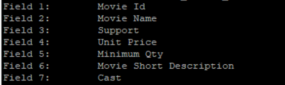

- [Introduction](#introduction)
- [Description of Examples in *examples* Subdirectory](#description-of-examples-in-examples-subdirectory)
  - [Example 1 - Simple CSV file (*sample\_1.csv*)](#example-1---simple-csv-file-sample_1csv)
  - [Example 2 - Let's add Chapters (*sample\_2.csv*)](#example-2---lets-add-chapters-sample_2csv)
  - [Example 3 - Starting from an Excel Worksheet  (*sample\_3.csv*)](#example-3---starting-from-an-excel-worksheet--sample_3csv)

# Introduction
The *examples* directory contains several sample files, organized into distinct subdirectories named as follows:

> *./csv2mdText/examples/sample_n*

being *n* an increasing index.

Examples are explained in details below. In the following we assume that *csv2mdText* has been compiled and installed according to instructions in main [README](../README.md) file.

# Description of Examples in *examples* Subdirectory
## Example 1 - Simple CSV file (*sample_1.csv*)
This file is located into the *./csv2mdText/examples/sample_1* subdirectory. Let's start from there:

> cd ./csv2mdText/examples/sample_1

It contains a list of DVDs with related information organized into a CSV file. Figure below depicts the content of the input CSV file in tabular format (e.g. through Excel):

The first row in the file is an header that contains the name of the corresponding columns. Column names can be printed by issuing the following command:

> $ csv2mdText -d sample_1.csv

which provides:

The markdown template file used by this example is *sample_1_template.md*, which is structured as follows:

> $ cat sample_1_template.md

Please observe that the correspondence among placeholders in the markdown template (i.e. *$n* strings) and actual values extracted from rows of the input CSV files is as follows:

- *$1* is substituted by: *Movie Id*
- *$2* is substituted by: *Movie Name*
- *$3* is substituted by: *Support*
- *$4* is substituted by: *Unit Price*
- *$5* is substituted by: *Minimum Qty*
- *$6* is substituted by: *Movie Short Description*
- *$7* is substituted by: *Cast*

The markdown output (*sample_1.md*) is obtained by issuing the following command:

> csv2mdText -i sample_1.csv -o sample_1.md -t sample_1_template.md

As explained in main [README](../README.md) file, the tool scans the csv input file (*sample_1.csv*) row-by-row and builds the output markdown file (*sample_1.md*) by concatenating multiple instances of the markdown template (*sample_1_template.md*), one for each row of the input csv file. When adding a new instance of the template file to the output file under construction, it substitutes all placeholders with the corresponding column values extracted from the current row of the input csv file.

The output appears as follows:

By using [pandoc](https://pandoc.org/) or some online converters the output can be easily converted into other formats (e.g. *.docx* or *pdf*). Here follows the result converted into *docx* format:

## Example 2 - Let's add Chapters (*sample_2.csv*)
This example is contained into the *./csv2mdText/examples/sample_2* subdirectory:

> cd ./csv2mdText/examples/sample_2

It is similar to the previous one, but adds a small enhancement. Let's observe that DVDs can be classified into categories (e.g. science fiction, comedy, etc.). File *sample_2.csv* contains a further column with respect to the previous CSV file to add this information to our list of DVDs:

Looking at the file above we can see that the new *Category* attribute has been added in column no. 3. Further, observe also that all DVDs characterized by the same category are grouped in consecutive rows (i.e. all *Classic* DVDs, then all *Hitchcock* ones, etc.). This is extremely important, for a reason that will appear clear immediately below.

Let's now define a new markdown template for the higher level section:

> $ cat sample_2_sectionTemplate.md

This template refers to column 3, which is the attribute in the input CSV file that is used to group together rows that shall be associated one another (i.e. DVDs that belong to the same category).

By issuing the following command:

> csv2mdText -i sample_2.csv -o sample_2.md -t sample_2_template.md -c sample_2_sectionTemplate.md

the tool acts similarly to the previous case (Example 1 above), with one substantial difference. In fact, observe that a chapter markdown template has been provided (option *-c*), and that column no. 3 has been specified in it. This instructs *csv2mdText* to monitor for changes in the content of column no. 3 while scanning the input CSV file row-by-row. Whenever the content of column no. 3 changes, *csv2mdText* closes the previous chapter in the document and opens a new one. From a practical point of view, it adds an instance of the chapter markdown template (i.e. *sample_2_sectionTemplate.md* in our example) to the file under construction, then continues processing as usual. Of course, when doing so it also substitutes placeholders (*$n*) of the chapter markdown template with actual values, according to the general mechanism already explained.

The obtained result is the following:

**Note well:** it is important to keep together rows with the same values of the column specified in the chapter markdown template (e.g. column no. 3 in this example), because the tool works sequentially on input rows. In other words, when producing the output markdown, it closes the old chapter and opens a new one whenever the content of this column changes. Therefore, to keep all relevant information under the same chapter, it is mandatory that they are grouped together in the input CSV file.

**Note well:** observe that in this example the basic markdown template is almost the same as the one in Example 1, with the only difference that placeholders numbers have been adjusted according to the new column inserted in 3-rd position.

## Example 3 - Starting from an Excel Worksheet  (*sample_3.csv*)
This example is contained into the *./csv2mdText/examples/sample_3* subdirectory:

> cd ./csv2mdText/examples/sample_3

In this case, we assume to start from data contained into an Excel Worksheet, such as the one contained in the directory above (*sample_3.xlsx*). This worksheet basically contains all the information seen in previous example, plus another column that describes the plot. Figure below shows the resulting Excel sheet:

Please observe that the plot of each movie, contained in column 8 of the Excel file, is quite long and contains several paragraphs, with blank lines in the middle. This does not represent a problem. In fact, Excel is able to handle such data and to save the file in CSV format. For the purpose, the file shall be saved as *CSV UTF-8* format (*File* -> *Save As* -> select *CSV UTF-8* from drop down menu):

It is strongly recommended to select CSV UTF-8 instead of simple CSV to avoid uncommon codings that may cause problems.

Once done that, the resulting CSV file typically contains "multiline" rows, i.e. rows that span multiple consecutive lines. This happens because the *Plot* information, which comprises several rows, is enclosed within quotes and split over more lines (see below):

The *csv2mdText* tool is able to manage CSV files as the one above, with fields spanning over multiple lines, given that their length does not exceed 8191 characters, with multiple paragraphs no longer than 2047 characters each.

The command used for conversion is always the same, i.e.:

> csv2mdText -i sample_3.csv -o sample_3.md -t sample_3_template.md -c sample_3_sectionTemplate.md

The result (*sample_3.md*) is shown below:

